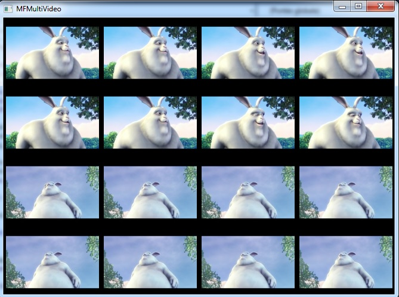
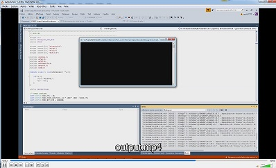

# Stackoverflow
All source codes I've provided on stackoverflow as an answer, usually under tags ms-media-foundation. Most of the source codes here are quick fixes to source code from people asking for help. So be careful, it's not necessarily the most appropriate way to do it. That just answers the question. It' s up to the user to improve the code.

In the programs below, some values are harcoded, like video file path for example :

#define VIDEO_FILE L"C:\\\\Users\\\\Public\\\\Videos\\\\Sample Videos\\\\Wildlife.wmv"

Dont't forget to change them, if you use a different video file, in a different path.

## AudioSourceReaderSeek
This program uses SourceReader to check seek position with audio file.

stackoverflow question : https://stackoverflow.com/questions/49739170/imfsourcereader-m4a-audio-accurate-frame-seek

## CustomVideoMixer
This program shows the basic essentials for implementing a custom video mixer, to be used by a media session.

You must register the CustomVideoMixer.dll with this command, and with the administrator rights : regsrv32 CustomVideoMixer.dll.

Be careful, the width and height of both videos are hardcoded (320x240). See VIDEO_WIDTH_1 and VIDEO_HEIGHT_1, change it if necessary.

In this example, I use two identical mp4 files, big_buck_bunny_240p_5mb.mp4 and a copy of itself. the two videos use NV12 video format as input. therefore, there is no real alpha mix, but both videos can be displayed next to each other, as the picture below.

stackoverflow question : https://stackoverflow.com/questions/42946608/media-foundation-custom-mixer-mft-getting-error-mf-e-cannot-create-sink

## EncodeWithSourceReaderSinkWriter

Encode a video file using SourceReader and SinkWriter manually.

stackoverflow question : https://stackoverflow.com/questions/55054531/media-foundation-video-re-encoding-producing-audio-stream-sync-offset

## FrameRateConverterDSP

This program shows how to use the Frame Rate Converter DSP (CLSID_CFrameRateConvertDmo), using a Source Reader. You can change the frame rate of a video stream. For example, if the video has 30 fps, you can get 60 fps.

stackoverflow question : https://stackoverflow.com/questions/8412343/how-to-use-frame-rate-convertor-dmo-in-mf-app

## IMFSinkWriterCallback

This program shows how to use an IMFSinkWriterCallback and event to wait for the Finalize method on the Sink Writer. The program simply create a wmv video file with blue frames, using the Sink Writer.

stackoverflow question : https://stackoverflow.com/questions/34189440/imfsinkwritercallback-never-happens

## MFVideoCaptureEVR

This program shows how to setup EVR (enhanced video renderer), and how to provide video capture samples to it, using a Source Reader.
Same as MFVideoEVR, but with video capture card source.

stackoverflow question : https://stackoverflow.com/questions/59616228/webcam-source-to-evr-sink

## MFVideoEVR

This program shows how to setup EVR (enhanced video renderer), and how to provide video samples to it, using a Source Reader.
Same as MFVideoCaptureEVR, but with video file source.

stackoverflow question : https://stackoverflow.com/questions/32739558/media-foundation-evr-no-video-displaying

## MFMultiVideo

A program to see if there are memory leaks using 1 to 16 MediaSession.

stackoverflow question : https://stackoverflow.com/questions/58912803/media-foundation-multiple-videos-playback-results-in-memory-leak-crash-after-u

## MinimalSinkRenderer

This program shows the basic essentials for implementing a custom sink renderer, to be used by a Media Session. The stream sink format is MFVideoFormat_RGB32.

You must register the MinimalSinkRenderer.dll with this command, and with the administrator rights : regsrv32 MinimalSinkRenderer.dll.

stackoverflow question : https://stackoverflow.com/questions/52198300/how-to-have-custom-video-media-stream-sink-request-rgb32-frames-in-media-foundat

## ScreenCaptureEncode

This program takes screenshots using Directx9, and create a mp4 video file with Mediafoundation API. In this example, the video duration is 5 seconds, see VIDEO_FRAME_COUNT to change it.

stackoverflow question : https://stackoverflow.com/questions/33753912/directx-screen-capture-and-output-as-video

## TranscodeMp4ToMp4
This program transcode a mp4 video file into a new mp4 file, using mp4 Sink Writer and a Media Session with topology. There is no real encoding process, because output file has the same format as input file.
The concept was to show how to setup IMFTopologyNode for both audio and video.

stackoverflow question : https://stackoverflow.com/questions/52025546/configuring-the-mpeg4mediasink

## VideoStabilizationMFT

Using the Video Stabilization MFT with Source Reader and Sink Writer.

stackoverflow question : https://stackoverflow.com/questions/59471641/trying-to-use-a-mft-in-media-foundation-encoding
